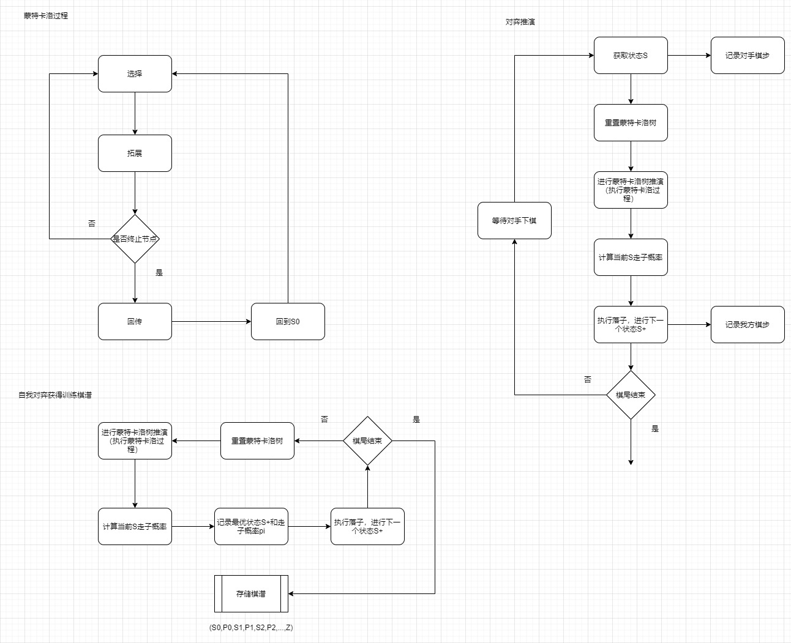
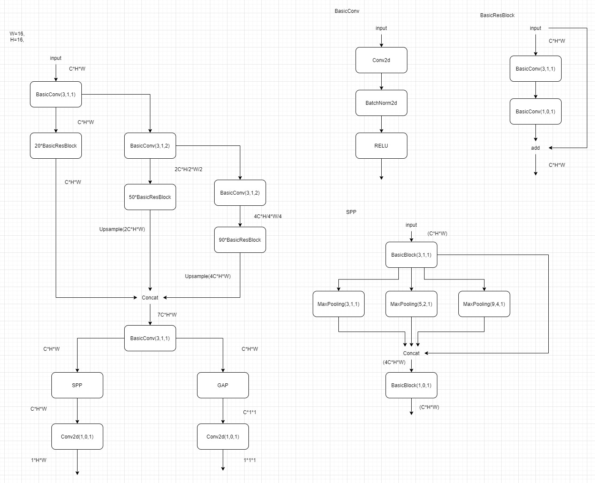
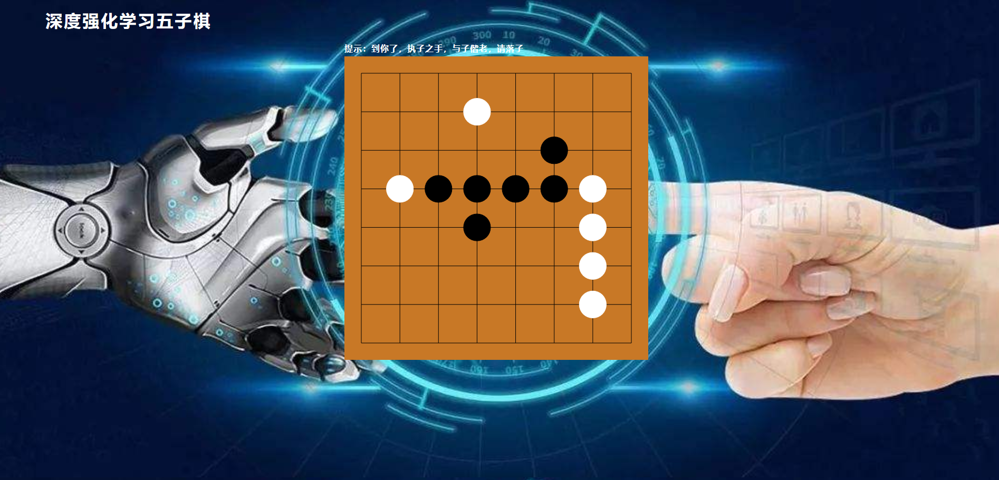
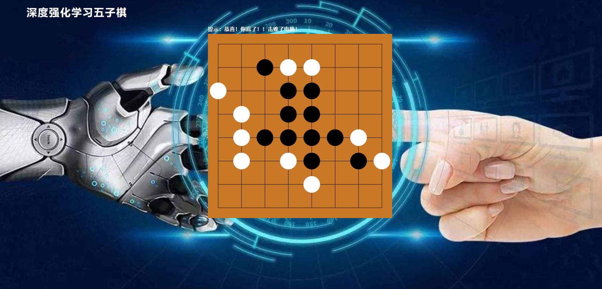
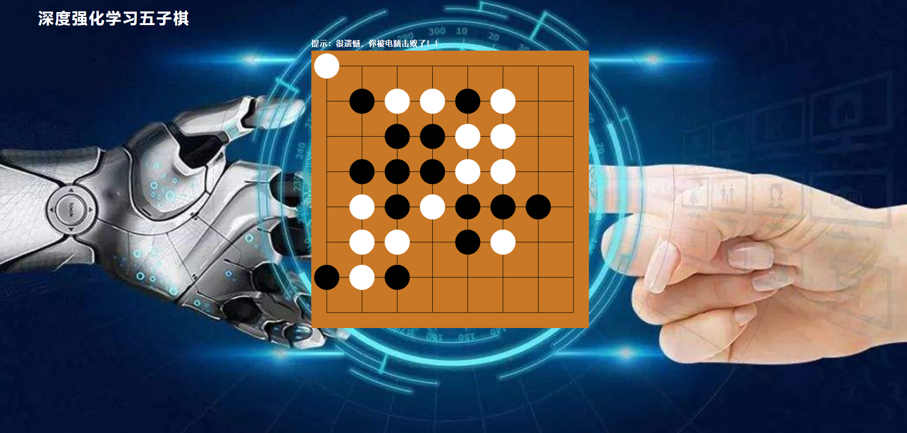

# 深度强化学习五子棋

实现了基于蒙特卡洛树和策略价值网络的深度强化学习五子棋。

## 特点
- 自我对弈
- 详细注释
- 流程简单

## 代码结构
- net：策略价值网络实现
- mcts：蒙特卡洛树实现
- server：前端界面代码
- legacy：废弃代码
- docs：其他文件
- utils：工具代码
- network.py：移植过来的网络结构代码
- model_5400.pkl：移植过来的网络训练权重
- train_agent.py：训练脚本
- web_server.py：对弈服务脚本
- web_server_demo.py：对弈服务脚本（移植网络）

## 流程

## 策略价值网络

采用了类似ResNet的结构，加入了SPP模块。

（目前，由于训练太耗时间了，连续跑了三个多星期，才跑了2000多个自我对弈的棋谱，经过实验，这个策略网络的表现，目前还是不行，可能育有还没有训练充分）

同时移植了另一个开源的策略网络以及其训练权重（network.py、model_5400.pkl），用于进行仿真演示效果。

## 训练

根据注释调整`train_agent.py`文件，并运行该脚本

## 仿真实验

根据注释调整`web_server.py`文件，加载所用的预训练权重，并运行该脚本

浏览器打开网址：`http://127.0.0.1:8080/` 进行对弈

## 仿真实验（移植网络）

运行脚本：`python web_server_demo.py`

浏览器打开网址：`http://127.0.0.1:8080/` 进行对弈

## 参考文档
- <https://www.doc88.com/p-57516985322644.html>
- <https://zhuanlan.zhihu.com/p/139539307>
- <https://zhuanlan.zhihu.com/p/53948964>
